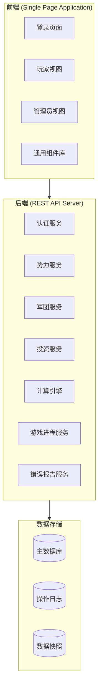

# Design Document: 下克上小助手

## Overview

下克上小助手是一个基于Web的文字游戏辅助系统，采用前后端分离架构。前端使用单页应用(SPA)模式，后端提供RESTful API。系统支持多用户并发访问，通过代码认证区分管理员和玩家权限。

核心设计目标：
- 简化繁杂的数据计算
- 提供直观的势力管理界面
- 支持游戏进程控制和数据回溯
- 确保数据一致性和计算准确性

## Architecture



## Components and Interfaces

### 1. 认证模块 (AuthModule)

```typescript
interface AuthService {
  login(code: string): Promise<AuthResult>;
  logout(): void;
  getCurrentUser(): User | null;
  validatePermission(action: string, resourceId: string): boolean;
}

interface AuthResult {
  success: boolean;
  userType: 'admin' | 'player';
  factionId?: string;
  errorMessage?: string;
}

interface User {
  type: 'admin' | 'player';
  factionId?: string;
  factionName?: string;
}
```

### 2. 势力服务 (FactionService)

```typescript
interface FactionService {
  getFactionData(factionId: string): Promise<FactionData>;
  updateFactionCode(factionId: string, newCode: string): Promise<void>;
  getAllFactions(): Promise<FactionSummary[]>;
}

interface FactionData {
  id: string;
  name: string;
  lordName: string;
  taxRate: number; // 0.4, 0.6, 0.8
  treasury: number;
  
  // 计算属性
  surfaceKokudaka: number;
  income: number;
  armyLevel: number;
  
  // 库存
  idleSoldiers: number;
  maxRecruitableSoldiers: number;
  rifles: number;
  horses: number;
  cannons: number;
  
  // 投资点数
  agriculturePoints: number;
  commercePoints: number;
  navyPoints: number;
  armamentPoints: number;
  
  // 关联数据
  territories: Territory[];
  samurais: Samurai[];
  legions: Legion[];
  diplomacy: DiplomacyRelation[];
  buffs: Buff[];
}
```

### 3. 军团服务 (LegionService)

```typescript
interface LegionService {
  createLegion(data: CreateLegionRequest): Promise<Legion>;
  disbandLegion(legionId: string): Promise<void>;
  updateLegionSoldiers(legionId: string, count: number): Promise<void>;
  updateLegionEquipment(legionId: string, equipment: Equipment): Promise<void>;
  reassignCommander(legionId: string, samuraiId: string): Promise<void>;
}

interface CreateLegionRequest {
  name: string; // 1-8个简体中文字符
  commanderId: string;
  soldierCount: number;
  rifles: number;
  horses: number;
  cannons: number;
  locationId: string;
}

interface Legion {
  id: string;
  name: string;
  commanderId: string;
  commanderName: string;
  soldierCount: number;
  rifles: number;
  horses: number;
  cannons: number;
  locationId: string;
  locationName: string;
}
```

### 4. 计算引擎 (CalculationEngine)

```typescript
interface CalculationEngine {
  // 核心计算
  calculateSurfaceKokudaka(faction: FactionData): number;
  calculateIncome(surfaceKokudaka: number, taxRate: number): number;
  calculateMaxRecruitableSoldiers(territoryKokudaka: number, taxRate: number): number;
  calculateSoldierMaintenanceRatio(faction: FactionData): number;
  calculateBonusCoefficient(maintenanceRatio: number): number;
  calculateGrowthRate(maintenanceRatio: number): number;
  
  // 维护费计算
  calculateMaintenanceCost(faction: FactionData): MaintenanceCost;
  
  // 投资计算
  calculateInvestmentResult(samurai: Samurai, investmentType: string, amount: number): InvestmentResult;
}

// 士兵维持比区间效果
const MAINTENANCE_RATIO_EFFECTS = [
  { min: 0, max: 0.20, bonusCoefficient: 0.12, growthRate: 0.03 },
  { min: 0.21, max: 0.45, bonusCoefficient: 0.06, growthRate: 0.01 },
  { min: 0.46, max: 0.60, bonusCoefficient: 0, growthRate: -0.01 },
  { min: 0.61, max: 0.80, bonusCoefficient: -0.10, growthRate: -0.02 },
  { min: 0.81, max: 0.94, bonusCoefficient: -0.20, growthRate: -0.04 },
  { min: 0.95, max: 1.00, bonusCoefficient: -0.30, growthRate: -0.08 }
];
```

### 5. 投资服务 (InvestmentService)

```typescript
interface InvestmentService {
  executeInvestment(request: InvestmentRequest): Promise<InvestmentResult>;
  getInvestmentPreview(request: InvestmentRequest): InvestmentPreview;
}

interface InvestmentRequest {
  factionId: string;
  samuraiId: string;
  type: 'agriculture' | 'commerce' | 'navy' | 'armament';
  targetTerritoryId?: string; // 商业系统需要
  amount?: number; // 商业系统投入资金
}

interface InvestmentResult {
  success: boolean;
  outcome: 'critical_success' | 'success' | 'failure';
  pointsGained: number;
  newLevel: number;
  message: string;
  roll: number; // D100结果
}

interface InvestmentPreview {
  successRate: number;
  modifierCoefficient: number;
  expectedPointsOnSuccess: number;
  expectedPointsOnCritical: number;
  expectedPointsOnFailure: number;
  cost: number;
}
```

### 6. 游戏进程服务 (GameProgressService)

```typescript
interface GameProgressService {
  advanceYear(): Promise<YearEndSettlement>;
  lockGame(): Promise<void>;
  unlockGame(): Promise<void>;
  isGameLocked(): boolean;
  
  // 回溯功能
  getOperationHistory(limit: number): Promise<OperationRecord[]>;
  rollbackToRecord(recordId: string): Promise<void>;
  createSnapshot(): Promise<string>;
}

interface YearEndSettlement {
  year: number;
  factionSettlements: FactionSettlement[];
}

interface FactionSettlement {
  factionId: string;
  maintenanceCost: number;
  kokudakaGrowth: Map<string, number>; // territoryId -> growth
  newSurfaceKokudaka: number;
}
```

### 7. 错误报告服务 (ErrorReportService)

```typescript
interface ErrorReportService {
  reportError(report: ErrorReport): Promise<void>;
  getErrorReports(filter?: ErrorReportFilter): Promise<ErrorReport[]>;
  markAsResolved(reportId: string): Promise<void>;
}

interface ErrorReport {
  id: string;
  playerId: string;
  playerName: string;
  factionId: string;
  timestamp: Date;
  errorType: 'manual' | 'automatic';
  errorMessage?: string;
  recentOperations: OperationRecord[];
  resolved: boolean;
}

interface OperationRecord {
  id: string;
  timestamp: Date;
  userId: string;
  action: string;
  details: Record<string, any>;
  snapshotId?: string;
}
```

## Data Models

### 核心数据模型

```typescript
interface Territory {
  id: string; // 郡代码，如 RUXI02
  provinceName: string; // 令制国
  districtName: string; // 郡名
  castleName: string;
  castleLevel: number; // 1-7
  baseKokudaka: number;
  specialProduct1?: string;
  specialProduct2?: string;
  specialProduct3?: string;
  developableProduct?: string; // 可发展特产
  factionId?: string;
  garrisonLegionId?: string;
  description?: string;
}

interface Samurai {
  id: string;
  name: string;
  type: 'warrior' | 'strategist'; // 猛将/智将
  martialValue: number; // 武功
  civilValue: number; // 文治
  factionId: string;
  isIdle: boolean;
  actionPoints: number; // 初始2，每回合重置为2
  currentLegionId?: string;
}

interface SpecialProduct {
  name: string;
  annualKokudaka: number;
  annualHorses: number;
  soldierCapacityBonus: number;
  kokudakaBonus: number; // 百分比
  otherEffects: string;
}

interface DiplomacyRelation {
  targetFactionId: string;
  targetFactionName: string;
  relation: 'alliance' | 'hostile' | 'neutral' | string;
}

interface Buff {
  name: string;
  effect: string;
}
```

### 投资等级表

```typescript
const AGRICULTURE_LEVELS = [
  { level: 0, name: '荒废', minPoints: 0, maxPoints: 0, growthBonus: -0.01, kokudakaBonus: -0.05 },
  { level: 1, name: '开垦', minPoints: 1, maxPoints: 15, growthBonus: 0, kokudakaBonus: 0 },
  { level: 2, name: '井田', minPoints: 16, maxPoints: 30, growthBonus: 0.005, kokudakaBonus: 0 },
  { level: 3, name: '检地', minPoints: 31, maxPoints: 50, growthBonus: 0.01, kokudakaBonus: 0.02 },
  { level: 4, name: '治水', minPoints: 51, maxPoints: 70, growthBonus: 0.015, kokudakaBonus: 0.04 },
  { level: 5, name: '丰饶', minPoints: 71, maxPoints: 85, growthBonus: 0.02, kokudakaBonus: 0.06 },
  { level: 6, name: '天府', minPoints: 86, maxPoints: 99, growthBonus: 0.025, kokudakaBonus: 0.08 },
  { level: 7, name: '瑞穗', minPoints: 100, maxPoints: 100, growthBonus: 0.03, kokudakaBonus: 0.10 }
];

const ARMAMENT_LEVELS = [
  { level: 0, name: '朽坏', minPoints: 0, maxPoints: 0, maintenanceModifier: 0.20 },
  { level: 1, name: '普通', minPoints: 1, maxPoints: 15, maintenanceModifier: 0 },
  { level: 2, name: '整修', minPoints: 16, maxPoints: 30, maintenanceModifier: -0.05 },
  { level: 3, name: '精良', minPoints: 31, maxPoints: 50, maintenanceModifier: -0.10 },
  { level: 4, name: '军械', minPoints: 51, maxPoints: 70, maintenanceModifier: -0.20 },
  { level: 5, name: '严整', minPoints: 71, maxPoints: 85, maintenanceModifier: -0.30 },
  { level: 6, name: '兵法', minPoints: 86, maxPoints: 99, maintenanceModifier: -0.40 },
  { level: 7, name: '武库', minPoints: 100, maxPoints: 100, maintenanceModifier: -0.50 }
];
```

## Correctness Properties

*A property is a characteristic or behavior that should hold true across all valid executions of a system-essentially, a formal statement about what the system should do. Properties serve as the bridge between human-readable specifications and machine-verifiable correctness guarantees.*

### Property 1: 权限隔离

*For any* 玩家用户和任意势力数据，该玩家只能访问和修改其所属势力的数据，不能访问其他势力的数据。

**Validates: Requirements 1.3, 1.6**

### Property 2: 将领唯一性约束

*For any* 军团集合，每个将领最多只能担任一个军团的指挥官，不存在同一将领同时指挥两个军团的情况。

**Validates: Requirements 5.9, 5.10**

### Property 3: 资源守恒

*For any* 军团创建、解散或编辑操作，势力的总资源（士兵、铁炮、战马、大筒）在操作前后保持守恒：库存减少量等于军团增加量，军团减少量等于库存增加量。

**Validates: Requirements 4.4, 6.2, 6.3, 6.5**

### Property 4: 表面石高计算正确性

*For any* 势力数据，表面石高的计算结果必须等于：领地石高 × (1 + 加成系数) + 特产石高 + 领内财产 + 产业石高。

**Validates: Requirements 2.3, 11.1**

### Property 5: 收入计算正确性

*For any* 势力数据，收入的计算结果必须等于：表面石高 × 税率 × 0.4。

**Validates: Requirements 2.2, 11.2**

### Property 6: 士兵上限计算正确性

*For any* 势力数据和税率，士兵上限的计算结果必须符合公式：税率40%时为领地石高×230，税率60%时为领地石高×200，税率80%时为领地石高×180。

**Validates: Requirements 11.3**

### Property 7: 士兵维持比区间效果

*For any* 士兵维持比值，系统返回的加成系数和自然增长率必须符合预定义的区间表。

**Validates: Requirements 11.4**

### Property 8: 投资判定正确性

*For any* 投资操作，成功率计算必须等于 50% + (武士属性 - 70)%，且锁定在5%-95%范围内；修正系数必须等于 1 + (武士属性 - 70) × 1%。

**Validates: Requirements 7.5, 7.6**

### Property 9: 维护费计算正确性

*For any* 势力数据，年度维护费计算必须等于：步卒×4 + 战马×12 + 铁炮×3 + 大筒×450 + 军团士兵×4 + 武士数×2000，并应用武备等级的维护费修正。

**Validates: Requirements 11.5, 11.6, 11.7**

### Property 10: 数据回溯一致性

*For any* 回溯操作，执行回溯后的系统状态必须与该操作记录完成时的快照状态完全一致。

**Validates: Requirements 9.7**

### Property 11: 错误报告完整性

*For any* 错误报告（手动或自动），报告必须包含玩家最近五步操作记录，且这些记录按时间顺序排列。

**Validates: Requirements 14.2, 14.3, 14.5**

### Property 12: 军团名称验证

*For any* 军团创建请求，军团名称必须为1-8个简体中文字符，否则创建请求被拒绝。

**Validates: Requirements 5.2, 5.7**

### Property 13: 数值输入边界

*For any* 数值输入，输入值小于0时自动变为0，输入值大于最大值时自动变为最大值。

**Validates: Requirements 12.7, 12.8**

## Error Handling

### 认证错误
- 无效代码：返回错误提示，不授予任何权限
- 会话过期：自动跳转登录页面

### 业务逻辑错误
- 资源不足：阻止操作，显示具体缺少的资源
- 将领冲突：触发冲突处理流程
- 数据验证失败：高亮错误字段，显示具体错误信息

### 系统错误
- 网络错误：显示重试按钮，自动记录错误报告
- 服务器错误：显示错误弹窗，自动发送最近五步操作到管理员

### 错误报告机制
- 手动报告：玩家点击报错按钮触发
- 自动报告：系统捕获未处理异常时触发
- 报告内容：玩家信息、错误时间、错误描述、最近五步操作

## Testing Strategy

### 单元测试
- 测试所有计算引擎函数的正确性
- 测试数据验证逻辑
- 测试权限检查逻辑

### 属性测试 (Property-Based Testing)
- 使用 fast-check 库进行属性测试
- 每个属性测试运行至少100次迭代
- 测试标签格式：**Feature: gekokujo-assistant, Property N: [property_text]**

### 集成测试
- 测试完整的用户操作流程
- 测试数据一致性
- 测试回溯功能

### 测试覆盖重点
- 核心计算公式（表面石高、收入、士兵上限）
- 资源守恒约束
- 将领唯一性约束
- 权限隔离
- 错误报告完整性
