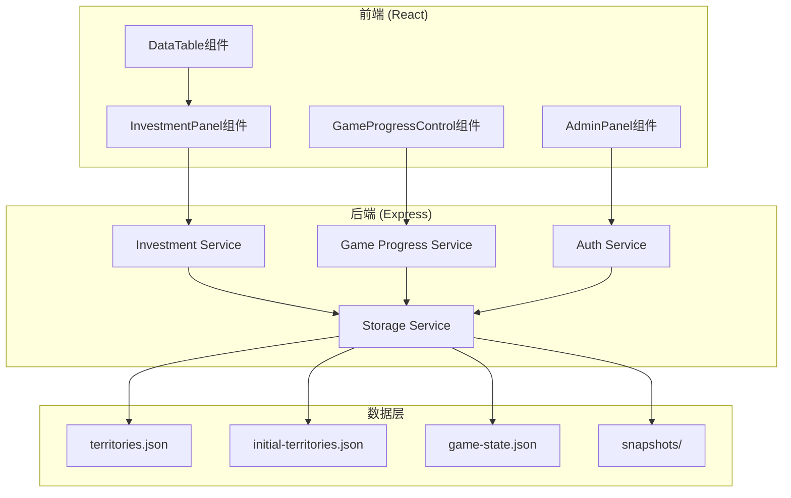

# Design Document: Mobile and System Update

## Overview

本设计文档描述了下克上小助手的系统更新实现方案，包括移动端适配、商业投资系统重构、投资确认机制、数值调整、回溯与重置系统、以及管理员安全密钥功能。

## Architecture

### 系统架构概览



## Components and Interfaces

### 1. DataTable组件移动端适配

修改 `client/src/components/DataTable.css` 和 `DataTable.tsx`：

```typescript
// DataTable.tsx 新增props
interface DataTableProps<T> {
  // ... 现有props
  mobileScrollable?: boolean; // 移动端滚动模式
}
```

```css
/* DataTable.css 移动端适配样式 */
.data-table-container {
  overflow-x: auto;
  -webkit-overflow-scrolling: touch;
}

.data-table-body td,
.data-table-header th {
  white-space: nowrap;
  min-width: 80px;
}
```

### 2. 商业投资系统重构

#### 2.1 新增接口定义

```typescript
// 商业投资请求
interface CommerceInvestmentRequest {
  factionId: string;
  samuraiId: string;
  territoryId: string;  // 目标郡国
  amount: number;       // 投入金额 (最低1000石)
}

// 商业投资结果
interface CommerceInvestmentResult {
  success: boolean;
  outcome: 'critical_success' | 'success' | 'failure';
  roll: number;
  successRate: number;
  message: string;
  refundAmount?: number;        // 大成功时退还金额
  developedProduct?: string;    // 开发的特产名称
  territoryId: string;
  costDeducted: number;
}
```

#### 2.2 成功率计算公式

```typescript
/**
 * 商业投资成功率计算
 * 基准：文治70 + 投入25500石 = 50%成功率
 * 文治100 + 投入50000石 = 100% (上限95%)
 * 文治40 + 投入1000石 = 5% (下限5%)
 * 
 * 公式推导：
 * - 文治贡献：(文治 - 40) / 60 * 45% = 文治每增加60点，成功率增加45%
 * - 金额贡献：(金额 - 1000) / 49000 * 45% = 金额每增加49000石，成功率增加45%
 * - 基础成功率：5%
 * - 最终成功率 = 5% + 文治贡献 + 金额贡献，限制在5%-95%
 */
function calculateCommerceSuccessRate(civilValue: number, amount: number): number {
  const civilContribution = ((civilValue - 40) / 60) * 0.45;
  const amountContribution = ((amount - 1000) / 49000) * 0.45;
  const rawRate = 0.05 + civilContribution + amountContribution;
  return Math.max(0.05, Math.min(0.95, rawRate));
}
```

### 3. 投资确认机制

#### 3.1 确认对话框组件

```typescript
interface InvestmentConfirmDialogProps {
  type: InvestmentType;
  preview: InvestmentPreview;
  onConfirm: () => void;
  onCancel: () => void;
}

interface InvestmentResultDialogProps {
  type: InvestmentType;
  result: InvestmentResult;
  onClose: () => void;
}
```

### 4. 回溯系统实现

#### 4.1 回溯服务接口

```typescript
interface RollbackService {
  // 获取可回溯的操作列表
  getRollbackableOperations(limit?: number): OperationRecord[];
  
  // 执行回溯
  rollbackToOperation(operationId: string): {
    success: boolean;
    error?: string;
  };
  
  // 清理回溯后的数据
  cleanupAfterRollback(operationId: string): void;
}
```

### 5. 重置系统实现

#### 5.1 初始数据管理

```typescript
// 初始数据结构
interface InitialData {
  territories: Territory[];
  createdAt: string;
  version: string;
}

// 重置服务接口
interface ResetService {
  // 保存当前数据为初始数据
  saveAsInitialData(): void;
  
  // 获取初始数据
  getInitialData(): InitialData | null;
  
  // 更新初始数据
  updateInitialData(territories: Territory[]): void;
  
  // 执行重置
  executeReset(): { success: boolean; error?: string };
}
```

### 6. 管理员安全密钥

#### 6.1 GameState扩展

```typescript
interface GameState {
  currentYear: number;
  isLocked: boolean;
  adminCode: string;
  securityKey: string;  // 新增：安全密钥
}
```

#### 6.2 安全密钥生成

```typescript
function generateSecurityKey(): string {
  const chars = 'ABCDEFGHIJKLMNOPQRSTUVWXYZabcdefghijklmnopqrstuvwxyz0123456789!@#$%^&*';
  let key = '';
  for (let i = 0; i < 32; i++) {
    key += chars.charAt(Math.floor(Math.random() * chars.length));
  }
  return key;
}
```

## Data Models

### 1. 扩展的Territory模型

```typescript
interface Territory {
  // ... 现有字段
  developableProduct?: string;  // 可开发特产
}
```

### 2. 初始数据文件结构

文件路径：`server/data/initial-territories.json`

```json
{
  "version": "1.0",
  "createdAt": "2024-01-01T00:00:00.000Z",
  "territories": [
    {
      "id": "...",
      "provinceName": "阿波",
      "districtName": "板野郡",
      "baseKokudaka": 37914,
      "specialProduct1": "阿波正蓝",
      "developableProduct": null
    }
  ]
}
```

### 3. 扩展的GameState

```json
{
  "currentYear": 1,
  "isLocked": false,
  "adminCode": "admin",
  "securityKey": "Abc123!@#XyzQwe456$%^Rst789&*("
}
```

## Correctness Properties

*A property is a characteristic or behavior that should hold true across all valid executions of a system-essentially, a formal statement about what the system should do. Properties serve as the bridge between human-readable specifications and machine-verifiable correctness guarantees.*

### Property 1: 商业投资成功率边界约束

*For any* 文治值和投入金额组合，计算出的成功率应始终在5%到95%之间（包含边界）。

**Validates: Requirements 2.6**

### Property 2: 商业投资最低金额验证

*For any* 商业投资请求，如果投入金额小于1000石，系统应拒绝该请求。

**Validates: Requirements 2.4**

### Property 3: 大成功退款计算

*For any* 商业投资，当随机数小于等于5时触发大成功，退还金额应等于投入金额的50%。

**Validates: Requirements 2.10**

### Property 4: 商业投资结果分支完整性

*For any* 商业投资执行，结果应根据（有/无可开发特产）×（成功/失败）四种情况返回正确的消息和数据变更。

**Validates: Requirements 2.11, 2.12, 2.13, 2.14**

### Property 5: 投资结果对话框数值显示

*For any* 投资结果，结果对话框应包含具体的数值变化信息（点数增长或特产开发）。

**Validates: Requirements 3.4**

### Property 6: 四种投资确认机制一致性

*For any* 投资类型（农业、商业、水军、武备），执行投资前都应显示确认对话框，确认后显示结果对话框。

**Validates: Requirements 3.6**

### Property 7: 回溯数据一致性

*For any* 回溯操作，回溯后的数据应与目标操作完成时的快照数据完全一致。

**Validates: Requirements 5.3**

### Property 8: 回溯后数据清理

*For any* 回溯操作完成后，目标操作之后的所有操作记录和快照应被删除。

**Validates: Requirements 5.4**

### Property 9: 重置数据一致性

*For any* 重置操作，重置后的郡国数据应与初始数据备份完全一致。

**Validates: Requirements 6.3, 6.4**

### Property 10: 安全密钥格式验证

*For any* 生成的安全密钥，应包含大小写字母、数字和特殊字符，且长度至少32位。

**Validates: Requirements 8.3**

### Property 11: 双重认证支持

*For any* 登录尝试，使用管理员代码或安全密钥都应能成功进入管理员界面。

**Validates: Requirements 8.4**

### Property 12: 年度石高增长计算

*For any* 年度结算，每个领地的石高增长应等于该领地当前石高乘以所属势力的增长率。

**Validates: Requirements 7.1, 7.2**

## Error Handling

### 1. 商业投资错误处理

| 错误场景 | 错误消息 | 处理方式 |
|---------|---------|---------|
| 投入金额不足1000石 | "最低投资额为1000石" | 阻止提交 |
| 资金不足 | "资金不足" | 阻止提交 |
| 武士行动力不足 | "武士行动力不足" | 阻止提交 |
| 目标郡国不属于势力 | "无法投资非本势力领地" | 阻止提交 |

### 2. 回溯系统错误处理

| 错误场景 | 错误消息 | 处理方式 |
|---------|---------|---------|
| 快照不存在 | "该操作没有可用的快照" | 显示错误提示 |
| 恢复失败 | "恢复快照失败" | 显示错误提示，保持原数据 |

### 3. 重置系统错误处理

| 错误场景 | 错误消息 | 处理方式 |
|---------|---------|---------|
| 确认文本不匹配 | "确认文本不正确" | 阻止重置 |
| 初始数据不存在 | "初始数据不存在，请先保存初始数据" | 显示错误提示 |

## Testing Strategy

### 单元测试

使用 Vitest 进行单元测试：

1. **商业投资成功率计算测试**
   - 测试边界值（文治40/100，金额1000/50000）
   - 测试中间值
   - 测试超出边界的输入

2. **安全密钥生成测试**
   - 测试密钥长度
   - 测试字符类型覆盖

3. **回溯功能测试**
   - 测试数据恢复正确性
   - 测试后续数据清理

### 属性测试

使用 fast-check 进行属性测试：

1. **成功率边界属性测试** - 验证任意输入下成功率在5%-95%范围内
2. **大成功退款属性测试** - 验证退款金额计算正确
3. **安全密钥格式属性测试** - 验证生成的密钥符合格式要求

### 集成测试

1. **投资流程测试** - 测试完整的投资流程（选择→确认→执行→结果）
2. **回溯流程测试** - 测试完整的回溯流程
3. **重置流程测试** - 测试完整的重置流程

### 测试配置

```typescript
// vitest.config.ts
export default {
  test: {
    globals: true,
    environment: 'node',
    coverage: {
      reporter: ['text', 'json', 'html'],
    },
  },
};
```
